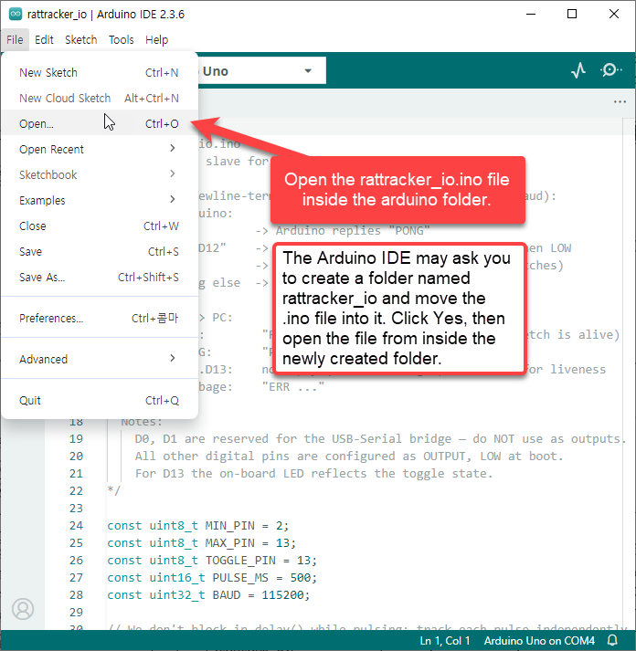
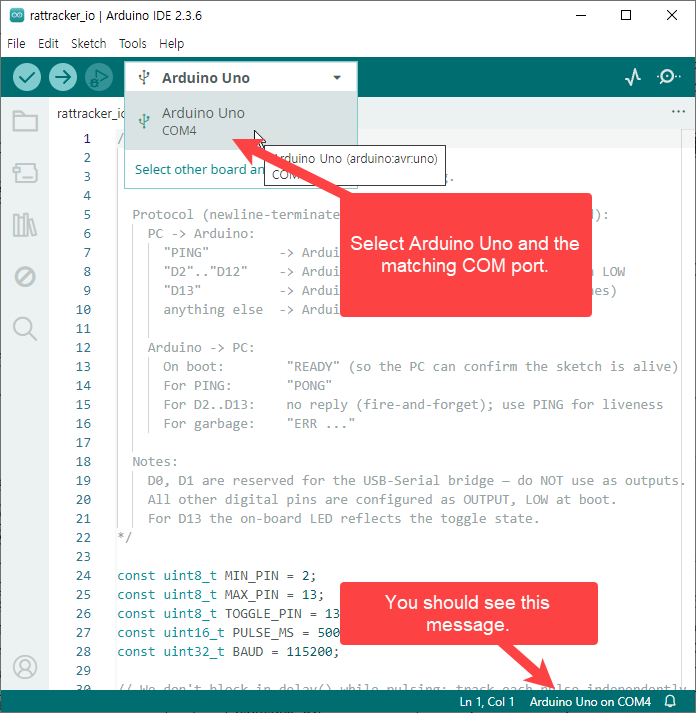
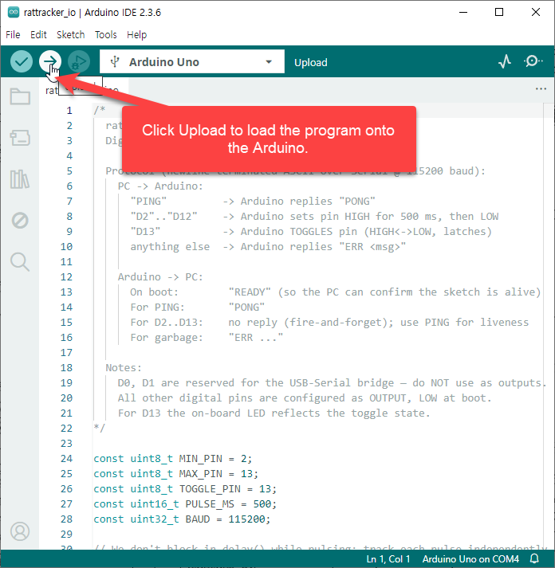

# Arduino Setup

Step-by-step instructions for uploading the `rattracker_io.ino` sketch to your Arduino board.

## Prerequisites

- Install the [Arduino IDE](https://www.arduino.cc/en/software) if you don't already have it.
- Plug the Arduino into the PC via USB.
- Note the COM port (see step 4 of the main README).

## Steps

### 1. Open the sketch

Open the `rattracker_io.ino` file inside the `arduino` folder.

The Arduino IDE may ask you to create a folder named `rattracker_io` and move the `.ino` file into it. Click **Yes**, then open the file from inside the newly created folder.

### 2. Select board and port

Select **Arduino Uno** and the matching COM port. You should see this message.

### 3. Upload

Click **Upload** to load the program onto the Arduino.

Wait until the IDE shows "Done uploading" at the bottom.

## Verifying

Open the **Serial Monitor** (top-right magnifying-glass icon) at **115200 baud**. Type `PING` and press Enter — you should see `PONG`.

> **Important:** close the Serial Monitor before running the main Python program. Only one process can hold the COM port at a time.